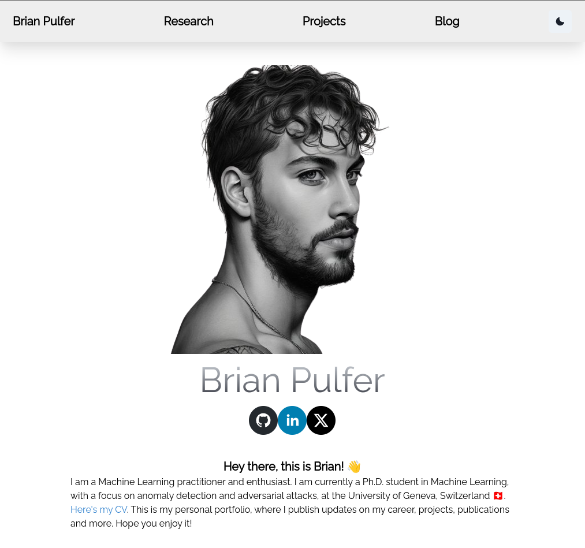

# Own website

    

Repository of my own website. 
The website is built using [NextJs](https://nextjs.org/), [Tailwind](https://tailwindcss.com/) and [Chakra-UI](https://chakra-ui.com/).

In the website, you'll be able to know more about who I am, my career, projects and how to contact me.

The website is reachable at 
<a href="https://www.brianpulfer.ch">www.brianpulfer.ch</a>